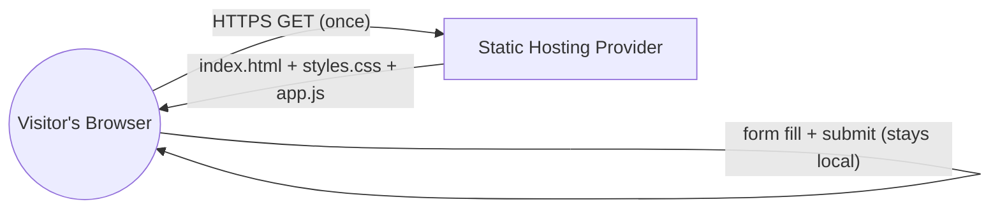
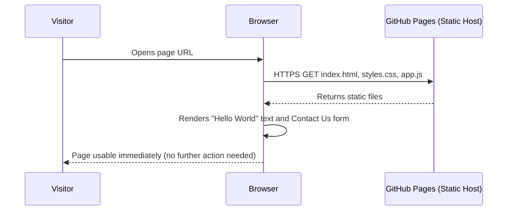
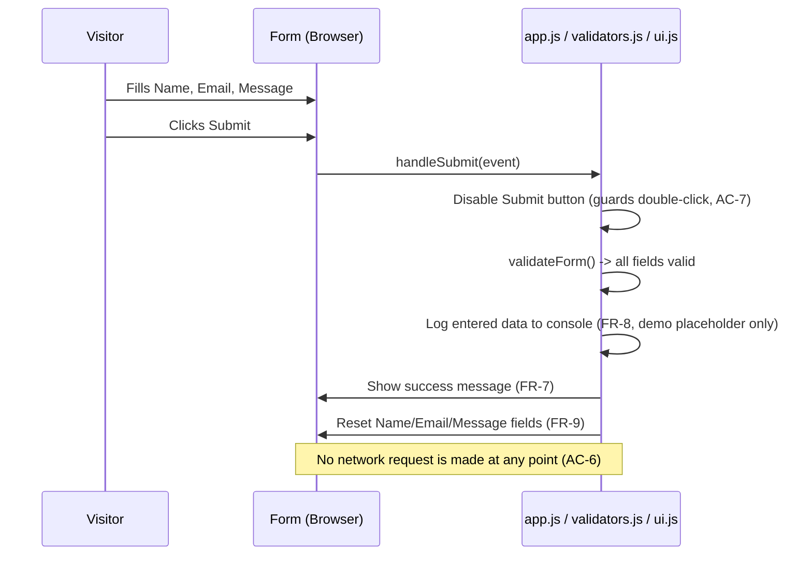
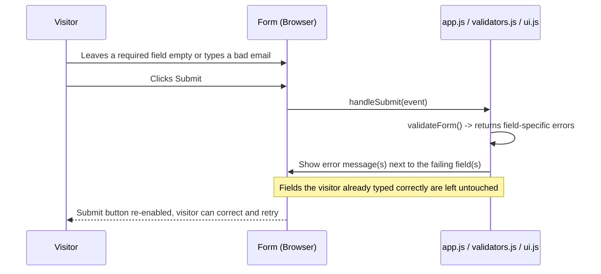
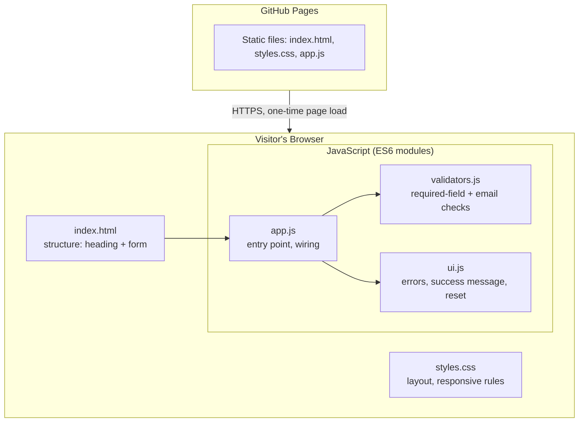

# Architecture — Hello World Landing Page

Source inputs: `requirements.md` (Approved, confirmed 2026-07-10), `planning.md` (Approved, confirmed 2026-07-10).

This document resolves the tech stack and hosting decision that `planning.md` left open under EPIC-6 (see A-10, A-12 in `requirements.md`). Because the project is small and has no backend or data storage, the design below is kept intentionally simple. There is no need for a service-oriented design, a database, or a container setup here.

---

## Architecture Overview

This is a single static web page, served directly to the visitor's browser, with no server-side logic at all.

- The whole product is one HTML page with a heading and a Contact Us form (FR-1, FR-2, FR-3).
- All behavior (showing text on load, validating the form, showing success/error messages, resetting the form) runs entirely in the visitor's browser using JavaScript (FR-4 through FR-9).
- There is no backend server, no API, and no database. Nothing the visitor types is sent over the network or stored anywhere outside their own browser tab (NFR-6, BR-2, BR-3).
- The page is delivered to the browser as static files (HTML, CSS, JS) from a hosting provider, over HTTPS (NFR-5).

Because the whole app is "front door only," the usual layered architecture (presentation / API / data) does not apply here. There is only one layer: the browser-rendered page.



No requirement in `requirements.md` calls for a backend, and several requirements explicitly forbid one (FR-8, NFR-6, BR-2, BR-3). So this architecture treats "no backend, no database" as a firm design constraint, not an oversight.

---

## Technology Stack

### Deviation from `.claude/project-config.json` placeholder stack

`.claude/project-config.json` lists a default placeholder stack of Node/Express (backend), React (frontend), PostgreSQL (database), and Docker. That file itself marks this as an example only, to be confirmed or replaced against the real requirements. `requirements.md` explicitly rules out any backend, any database, and any server-side handling of the form (see Scope, FR-8, NFR-6, BR-2, A-4, A-10). So this project deliberately does not use that placeholder stack. There is no Node/Express backend, no PostgreSQL database, and no Docker/container setup, because there is nothing here for any of those pieces to do. This deviation is intentional and matches what `requirements.md` and `planning.md` already call for.

### Chosen stack

| Layer | Choice | Why |
|---|---|---|
| Markup | HTML5 | Needed to hold the heading and form. Semantic tags (`<main>`, `<form>`, `<label>`) support NFR-7 (accessibility). |
| Styling | Plain CSS3 (Flexbox/Grid + media queries) | Handles the responsive layout needed for NFR-2 and AC-8, with no extra library weight. |
| Behavior | Vanilla JavaScript (ES6+), no framework | The only interactive logic is: read 3 fields, validate them, show/hide messages, reset the form, and guard against a double-click. This is well within what plain JavaScript handles cleanly. A framework like React would add a build step, a bundle to download, and ongoing dependency upkeep, for a page that does not need component re-use, routing, or state management across pages. That extra weight works against NFR-1 (fast load) and adds no real benefit for one page with one form. |
| Build tooling | None required | With no framework and no bundling need, there is nothing to compile. Files can be edited and served as-is. (See note below on an optional lightweight step.) |
| Backend | None | Ruled out by requirements (FR-8, NFR-6, BR-2, BR-3, A-4). |
| Database | None | Ruled out by requirements (NFR-6, BR-2, A-4). |
| Containerization | None | Not needed for a static file set; adds operational overhead with no corresponding benefit here. |

**Assumption / judgment call:** requirements.md leaves the exact frontend technology open (A-10) and states no strong preference was given. Given the project's size (one page, one form, no routing, no shared state), plain HTML/CSS/JS is the proportionate choice. If the team later wants this project to grow into a multi-page site with shared components, revisiting a lightweight framework at that time would be reasonable, but that is out of scope for the current requirements.

**Optional, not required:** a minimal step to minify `app.js`/`styles.css` before deploy could be added later purely as a performance nicety for NFR-1. This is not necessary at the current size of the page and is left out to keep the build simple, per the "design in proportion to the project" principle.

---

## Folder Structure

```
/ (repository root)
├── index.html                 # The single page: Hello World heading + Contact Us form
├── css/
│   └── styles.css             # Layout, responsive rules, visible focus states
├── js/
│   ├── app.js                 # Entry point: wires up the form on page load
│   ├── validators.js          # Required-field and email-format checks (FR-4, FR-5)
│   └── ui.js                  # Show/hide error messages, success message, form reset (FR-6, FR-7, FR-9)
├── assets/
│   └── favicon.ico            # Optional, small nicety, not tied to any requirement
├── .github/
│   └── workflows/
│       └── deploy.yml         # CI step that publishes the static files (see Deployment section)
├── requirements.md
├── planning.md
├── architecture.md
└── .claude/                   # SDLC pipeline scaffolding (unchanged by this design)
```

Notes on structure:
- `js/` is split into three small files (entry point, validation, UI feedback) instead of one large file. This keeps each piece easy to find and test, and matches the natural task split already used in `planning.md` (EPIC-3 = validation, EPIC-4 = success/reset).
- No `src/`, `dist/`, or `build/` folders are needed since there is no compile step.
- **Design System Handoff pointer:** since this is a `projectMode: "new"` project, UI implementation (the HTML structure, CSS, and styling of the page and form) should follow whatever is defined in the Design System Handoff artifact at `design-system-handoff/e2logy-design-system/README.md` (per `.claude/project-config.json` → `projectSettings.artifactPaths.designSystemHandoff`). As of this writing that artifact does not yet exist in the repository. This is a pointer only, for visual/styling decisions during development; it does not change or inform anything in this architecture document.

---

## Database Design

**Not applicable — deliberately, by design.**

`requirements.md` is explicit that no enquiry data is stored anywhere beyond the visitor's own browser tab (NFR-6, BR-2, BR-3), and FR-8 states the entered data may at most be logged to the browser's developer console as a demo placeholder. Because of this:

- No database engine is used (no PostgreSQL, despite it being listed as a placeholder default in `project-config.json` — see Technology Stack deviation note above).
- No `localStorage`, `sessionStorage`, or cookies are used to persist form data either, since FR-8 says nothing about the enquiry should persist after the visitor reloads or closes the page. Using browser storage would go beyond what was asked for and would technically create a small local "record" that outlives the current use of the form.
- Any values the visitor types exist only as normal JavaScript variables in memory while the page is open, and disappear once the tab is closed or reloaded.

If a future phase adds a real backend to actually receive or store enquiries (flagged as out of scope in R-2 of `requirements.md`), a database design would need to be added at that time, as new scope with its own requirements pass.

---

## API Design

**No network API exists in this project.** There is no server for the browser to call, and AC-6 specifically requires that no network request happens on submission. Instead of a real API, the "contract" here is the set of local JavaScript functions that the page's own script uses internally. These are shown below only as illustrative signatures, to make the design concrete, not as implementation code:

```
validateForm(formValues: { name, email, message }) -> { valid: boolean, errors: { name?, email?, message? } }
handleSubmit(event) -> void
    // prevents default browser submit, calls validateForm(),
    // then either showErrors(errors) or showSuccessAndReset()
showErrors(errors) -> void        // renders field-specific messages (FR-6), keeps existing input values
showSuccessAndReset() -> void     // shows the confirmation text (FR-7), logs data to console (FR-8), clears fields (FR-9)
```

Design pattern used: a small **module pattern** (one responsibility per file — validation, UI feedback, wiring) rather than one large script. This keeps the "no backend" boundary clean and makes it obvious, on review, that nothing here reaches out to the network.

The double-click guard from AC-7/US-4.3 is implemented as a simple UI state check (disable the Submit button immediately on click, re-enable it only if validation fails), not as a network-level idempotency concern, since there is no server to protect.

---

## Security

Because this is a static, backend-free page, most typical server-side attack surface (SQL injection, authentication bypass, API abuse, server misconfiguration) does not exist here at all. The security considerations that remain are:

- **Transport security (NFR-5):** the page must be served over HTTPS. This is provided by the hosting provider (see Deployment section) and requires no custom certificate work on our side.
- **Client-side input handling (NFR-4):** any value the visitor types (Name, Email, Message) must be written into the page using safe methods (e.g. setting `textContent`, not `innerHTML`, when echoing anything back, such as in the success message) so that a visitor cannot trigger a script-injection issue in their own browser session. This is a small but important coding rule to carry into development, not a runtime security control.
- **No secrets in the repository:** since there is no backend, there are no API keys, database passwords, or server credentials for this project to hold. The repository should stay free of any such values, and none are anticipated.
- **No authentication surface:** there is no login and no admin role (per the single "Visitor" role in `requirements.md`), so there is nothing to protect with access control.
- **Optional hardening:** a `Content-Security-Policy` meta tag restricting script sources to "self" can be added in `index.html` as a small extra layer, since the page loads no third-party scripts. This is optional polish, not a requirement, and can be skipped without affecting any FR/NFR.
- **Dependency risk:** since there is no framework and no package manager dependency tree, there is no third-party JavaScript library supply-chain risk to manage for this version of the page.

---

## Deployment

This section resolves the EPIC-6 placeholder from `planning.md` (US-6.1): "publish the finished page somewhere reachable over HTTPS."

### Hosting choice: GitHub Pages

The project already has a GitHub repository at `https://github.com/e2logydev-cyber/helloworld.git` (per `.claude/orchestrator-state.md`), with a `main` branch and a scaffolding branch already pushed. Given that a GitHub repository already exists and the site is a plain static file set, **GitHub Pages** is the recommended host:

- It serves static files directly from the repository, with no separate hosting account or infrastructure to set up.
- It provides HTTPS automatically on its default domain, satisfying NFR-5 with no extra certificate work.
- It fits the project's actual size. Alternatives such as Netlify, Vercel, or Azure Static Web Apps would work too, but they add an extra third-party account and integration step that this project does not need, since GitHub is already the source of truth here.

### Publish flow

1. The static files (`index.html`, `css/`, `js/`, `assets/`) live at the root of the repository on `main`.
2. GitHub Pages is turned on for the repository (Settings → Pages → Source: deploy from the `main` branch, root folder). This is a one-time repository setting, not something this document can turn on directly.
3. A small GitHub Actions workflow (`.github/workflows/deploy.yml`) publishes the page automatically each time changes land on `main`, using the standard `actions/upload-pages-artifact` + `actions/deploy-pages` actions. Since there is no build step, this workflow just packages the existing static files and hands them to Pages. Illustrative shape only (not full working YAML):

```
on: push to main
jobs:
  deploy:
    - checkout repository
    - upload static files as a Pages artifact
    - deploy the artifact to GitHub Pages
```

4. Because `main` is a protected branch (per `.claude/project-config.json`), changes reach `main` only through a reviewed pull request, matching the existing branch/PR rules already set up for this repository. This deployment step does not change or bypass that review process; it simply runs after a change is merged.

### What this means for EPIC-6 tasks in `planning.md`

- "Set up the hosting environment" → turn on GitHub Pages for this repository, pointed at `main`.
- "Turn on HTTPS" → automatic once GitHub Pages is enabled; no separate task needed.
- "Confirm the live, hosted page matches the version that was built and tested" → compare the deployed GitHub Pages URL against the reviewed/merged version on `main` after each deploy.

No CI/CD steps beyond the single deploy workflow are needed at this project's size (no test suite to run in CI yet, since testing here is manual per `planning.md`'s Non-Functional Quality checks in EPIC-5).

---

## Sequence Diagrams

### Page load (FR-1, AC-1)



### Successful form submission (FR-7, FR-8, FR-9, AC-3, AC-6, AC-7)



### Failed validation (FR-4, FR-5, FR-6, AC-4, AC-5)



---

## Component Diagrams



There is intentionally no "backend" box, no "database" box, and no "API gateway" box in this diagram, because none of those exist in this system. The only two real components are the browser (running the page) and the static host (serving the files).

---

## Summary of key decisions and assumptions

- Deliberately overriding the `techStack` placeholder in `.claude/project-config.json`: no Node/Express, no React, no PostgreSQL, no Docker. Reason: `requirements.md` rules out any backend, database, or server-side handling (FR-8, NFR-6, BR-2, BR-3, A-4, A-10).
- Chosen stack: plain HTML5, CSS3, vanilla JavaScript (ES6+), no build tool, no framework. Reason: proportionate to a one-page, one-form static site; keeps load time low (NFR-1) and avoids unneeded dependency/build overhead.
- No database, no browser storage (`localStorage`/cookies) for form data either, since requirements say nothing should persist after the visitor leaves the page (FR-8, NFR-6).
- Hosting: GitHub Pages, since a GitHub repository already exists for this project and Pages provides free HTTPS with no extra infrastructure. Resolves the EPIC-6 placeholder in `planning.md`.
- Deployment: a single GitHub Actions workflow packages and publishes the static files to Pages after a pull request is merged to `main`, respecting the existing branch protection already set up for this repository.
- Design System Handoff artifact (`design-system-handoff/e2logy-design-system/README.md`) does not exist yet as of this writing; it is called out only as a pointer for development to follow for UI styling, and has not influenced any decision in this document.
